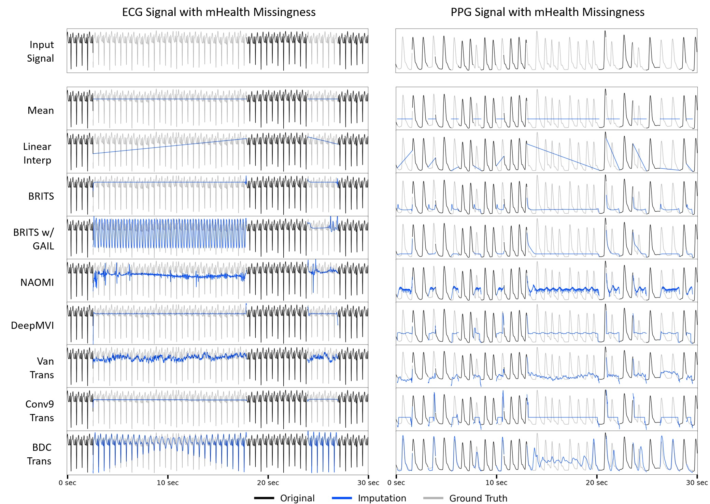
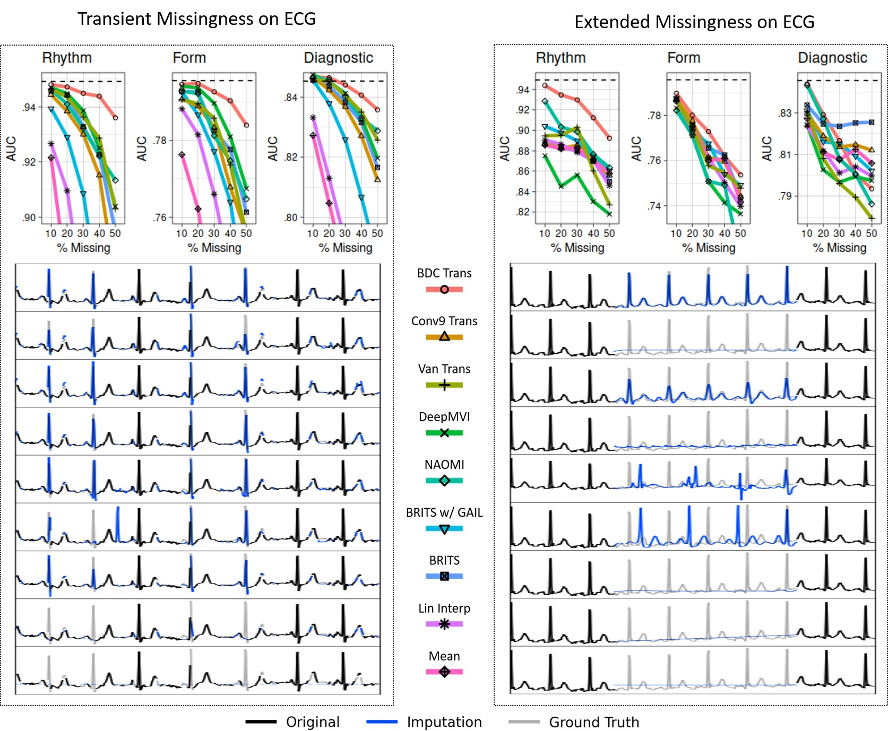

# PulseImpute Challenge

This is a repository containing PyTorch code for PulseImpute: A Novel Benchmark Task for Physiological Signal Imputation. You can find our key visualizations from the paper as well as instructions for for testing pre-trained models in the paper and training your own models in the instructions below.

 

 Visualization of imputation results from six baseline methods on representative ECG and PPG signals. Ablated regions of the input signals are drawn in light gray. The imputed values from each baseline are drawn in blue. The large temporal gaps which arise from real-world missingness patterns create substantial challenges for all methods. For example, methods such as BRITS and DeepMVI produce nearly constant outputs, while GAN-based approaches (BRITS w/ GAIL and NAOMI) hallucinate incorrect structures in incorrect locations. Our novel BDC Transformer architecture also struggles in the middle of long gaps. 

 

 Cardiac Classification in ECG Results for Transient and Extended Loss on Rhythm, Form, and Diagnosis label groups. For each label group, a cardiac classifier was trained and tested on complete data (test performance illustrated by dashed line). The trained model was then evaluated on imputed test data (for five levels of missingness from 10% to 50%) produced by each baseline, yielding the AUC curves (top). Representative imputation results for the 30% missingness test case are plotted (below), with (ablated) missingness in light gray and imputed values in blue. The Extended Loss setting proved to be more challenging for all methods. 

-----

## Installation

For this project we use [miniconda](https://docs.conda.io/en/latest/miniconda.html) to manage dependencies. After setting it up, you can install the pulseimpute environment:

    conda env create -f pulseimpute.yml
    conda activate pulseimpute

## Get data

Download our extracted mHealth ECG/PPG missingness patterns and curated datasets (MIMIC-III ECG/PPG Waveform and PTB-XL) via the follwing bash-script:

    ./get_data.sh

This script downloads and extracts the ECG missingness patterns (missing_ecg_{train/val/test}.csv)), PPG missingness patterns (missing_ppg_{train/val/test}.csv)), MIMIC-III ECG data (mimic_ecg_{train/val/test}.npy)), MIMIC-III PPG data (mimic_ppg_{train/val/test}.npy)), and PTB-XL ECG data (ptbxl_ecg.npy)) from the data hosted [here](https://www.dropbox.com/sh/6bygnzzx5t970yx/AAAHsVu9WeVXdQ_c1uBy_WkAa?dl=0) (469.8 MB compressed and 91.5 GB uncompressed)

## Get Pre-trained Checkpoints

Download our pre-trained checkpoints and imputed waveforms for each benchmarked models (BDC Transformer, Conv9 Transformer, Vanilla Transformer, DeepMVI, NAOMI, BRITS w/ GAIL, BRITS) for each PulseImpute task (ECG Heart Beat Detection, PPG Heart Beat Detection, ECG Cardiac Pathophysiology Classification) via the following bash script from the ckpts hosted [here](https://www.dropbox.com/sh/u4b7hq98acu7ssj/AADB_9ZrTAHe9hCAmN2Hbdnra?dl=0)

    ./get_ckpts.sh

## Evaluate Pre-Trained Models on Test Set with Downstream Tasks

Simply find the config of the model to be tested in their respective config file (e.g. configs/test_transformer_configs.py,  configs/test_brits_configs.py,  configs/test_naomi_configs.py) and in train_imp.py, set the config to that dictionary name to run the imputation model on the test set.

    python test_imp.py

## or Re-train from Scratch

Simply find the config of the model to be trained in their respective config file (e.g. configs/train_transformer_configs.py,  configs/train_brits_configs.py,  configs/train_naomi_configs.py) and in train_imp.py, set the config to that dictionary name to retrain each model from scratch.

    python train_imp.py

## Training your own custom model
Create the desired model class in models/modelname/modelname.py (See models/lstm/lstm.py for an example of a simple LSTM). The training and test methods for the lstm are in models/lstm_model.py. Create a corresponding config entry in configs/train_lstm_configs.py and run the training script train_imp.py with this config.      

